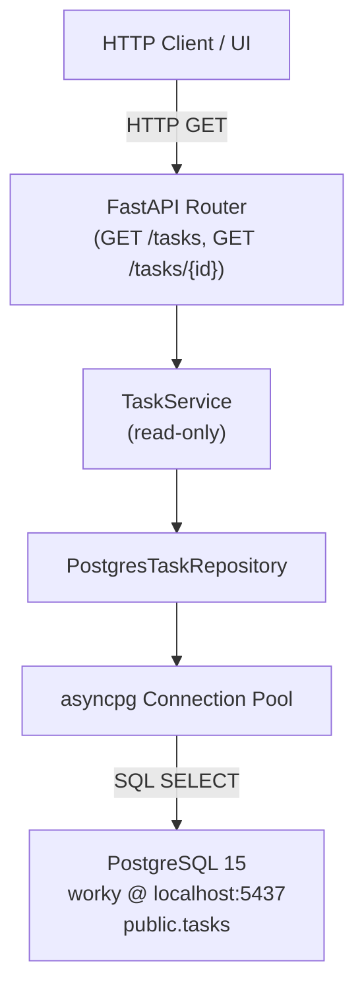
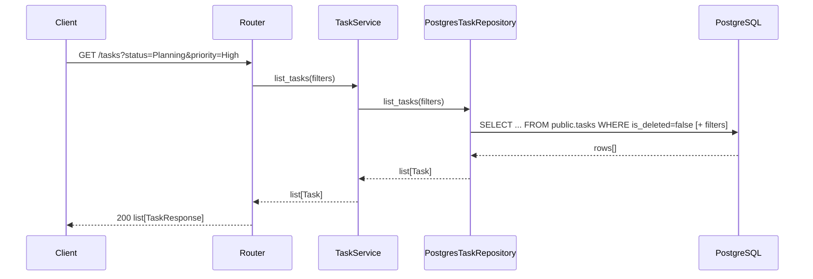
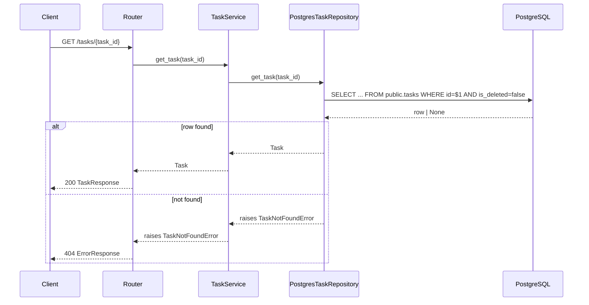
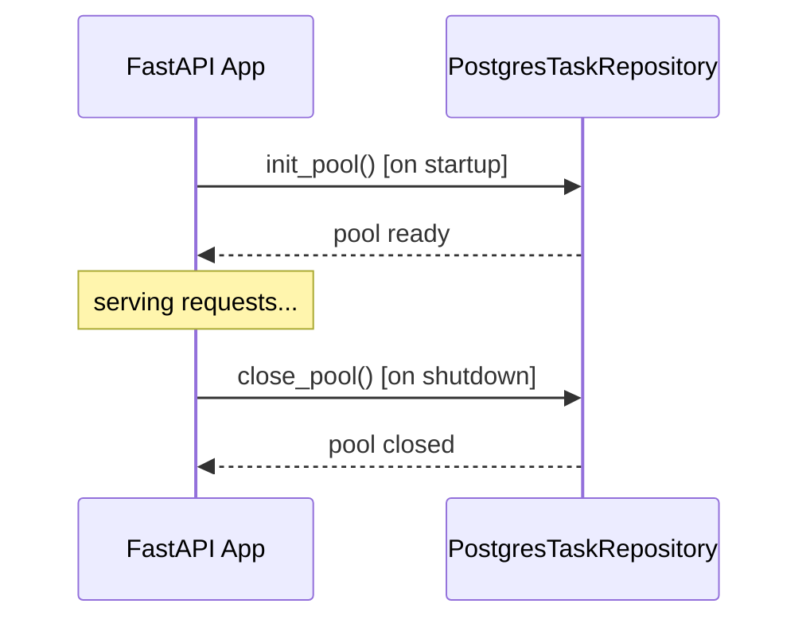

# Design Document: postgres-task-retrieval

## Overview

Replace the existing file-based JSON task store with a read-only PostgreSQL connection to an external `worky` database. All task creation, update, complete, and delete endpoints are removed; the API becomes a pure read layer that queries the `public.tasks` table and exposes GET endpoints for listing and retrieving tasks.

The change affects four layers: models (schema alignment), repository (JSON → psycopg2/asyncpg), service (strip write operations), and router (keep only GET routes). No other parts of the application (agent, middleware, error handling) are touched.

The external database is a PostgreSQL 15 instance running in Docker (`worky-postgres`) on port 5437, already populated with production task data.

---

## Architecture



### Key Architectural Decisions

- **asyncpg** is used for async PostgreSQL access, consistent with FastAPI's async model.
- A **connection pool** is created at application startup (`lifespan`) and torn down on shutdown — no per-request connections.
- The repository is **interface-compatible** with the old `TaskRepository` for the read methods (`list_tasks`, `get_task`), so `TaskService` requires minimal changes.
- `is_deleted = false` is always applied as a filter — soft-deleted rows are never surfaced.
- `TaskCreate`, `TaskUpdate`, `complete_task`, and `delete_task` are fully removed from all layers.

---

## Sequence Diagrams

### List Tasks



### Get Task by ID



### Application Startup / Shutdown



---

## Components and Interfaces

### PostgresTaskRepository

**Purpose**: Replaces `TaskRepository`. Executes read-only SQL against `public.tasks`.

**Interface**:
```python
class PostgresTaskRepository:
    async def init_pool(self) -> None: ...
    async def close_pool(self) -> None: ...
    async def list_tasks(self, filters: TaskFilters | None = None) -> list[Task]: ...
    async def get_task(self, task_id: str) -> Task: ...
```

**Responsibilities**:
- Manage an `asyncpg` connection pool (min=2, max=10)
- Map `public.tasks` rows to `Task` model instances
- Apply `is_deleted = false` on every query
- Apply optional filters (status, priority, sprint_id, assigned_to, phase_id)
- Raise `TaskNotFoundError` when a row is absent or soft-deleted

### TaskService (read-only)

**Purpose**: Thin orchestration layer between router and repository. Write methods removed.

**Interface**:
```python
class TaskService:
    async def list_tasks(self, filters: TaskFilters | None = None) -> list[Task]: ...
    async def get_task(self, task_id: str) -> Task: ...
```

### Tasks Router

**Purpose**: Exposes only GET endpoints.

**Interface**:
```
GET /tasks                  → list[TaskResponse]
GET /tasks/{task_id}        → TaskResponse
```

Query parameters for `GET /tasks`:
- `status: str | None`
- `priority: str | None`
- `sprint_id: str | None`
- `assigned_to: str | None`
- `phase_id: str | None`

### DatabaseSettings (config extension)

New fields added to `Settings` in `core/config.py`:

```python
pg_host: str = "localhost"
pg_port: int = 5437
pg_database: str = "worky"
pg_user: str = "postgres"
pg_password: str = ""
pg_min_connections: int = 2
pg_max_connections: int = 10
```

---

## Data Models

### Task (updated)

Aligned to the full `public.tasks` schema:

```python
class Task(BaseModel):
    id: str
    user_story_id: str
    name: str
    short_description: str | None = None
    long_description: str | None = None
    phase_id: str | None = None
    status: str = "Planning"
    priority: str = "Medium"
    assigned_to: str | None = None
    estimated_hours: float | None = None
    actual_hours: float | None = None
    start_date: date | None = None
    due_date: date | None = None
    completed_at: datetime | None = None
    sprint_id: str | None = None
    is_deleted: bool = False
    created_at: datetime | None = None
    updated_at: datetime | None = None
    created_by: str | None = None
    updated_by: str | None = None
```

### TaskResponse (updated)

Mirrors `Task` but excludes `is_deleted` (internal soft-delete flag not exposed):

```python
class TaskResponse(BaseModel):
    id: str
    user_story_id: str
    name: str
    short_description: str | None
    long_description: str | None
    phase_id: str | None
    status: str
    priority: str
    assigned_to: str | None
    estimated_hours: float | None
    actual_hours: float | None
    start_date: date | None
    due_date: date | None
    completed_at: datetime | None
    sprint_id: str | None
    created_at: datetime | None
    updated_at: datetime | None
    created_by: str | None
    updated_by: str | None
```

### TaskFilters

```python
class TaskFilters(BaseModel):
    status: str | None = None
    priority: str | None = None
    sprint_id: str | None = None
    assigned_to: str | None = None
    phase_id: str | None = None
```

### Removed Models

- `TaskCreate` — removed entirely
- `TaskUpdate` — removed entirely

---

## Algorithmic Pseudocode

### list_tasks Algorithm

```pascal
PROCEDURE list_tasks(filters: TaskFilters | None)
  INPUT: optional filter parameters
  OUTPUT: list of Task

  SEQUENCE
    query ← "SELECT * FROM public.tasks WHERE is_deleted = false"
    params ← []

    IF filters IS NOT NULL THEN
      FOR each (field, value) IN filters.non_null_fields DO
        query ← query + " AND " + field + " = $" + next_param_index
        params.append(value)
      END FOR
    END IF

    query ← query + " ORDER BY created_at DESC"

    rows ← await pool.fetch(query, *params)
    RETURN [row_to_task(row) FOR row IN rows]
  END SEQUENCE
END PROCEDURE
```

**Preconditions:**
- Pool is initialised and has at least one available connection
- `filters`, if provided, contains only valid column names

**Postconditions:**
- Returns zero or more `Task` objects
- All returned tasks have `is_deleted = false`
- Results ordered by `created_at DESC`

**Loop Invariants:**
- Each iteration appends exactly one `AND field = $n` clause and one param value; param index stays in sync with clause count

---

### get_task Algorithm

```pascal
PROCEDURE get_task(task_id: str)
  INPUT: task_id string
  OUTPUT: Task

  SEQUENCE
    row ← await pool.fetchrow(
      "SELECT * FROM public.tasks WHERE id = $1 AND is_deleted = false",
      task_id
    )

    IF row IS NULL THEN
      RAISE TaskNotFoundError(task_id)
    END IF

    RETURN row_to_task(row)
  END SEQUENCE
END PROCEDURE
```

**Preconditions:**
- `task_id` is a non-empty string
- Pool is initialised

**Postconditions:**
- Returns a `Task` if a non-deleted row with that ID exists
- Raises `TaskNotFoundError` otherwise; no partial state is returned

---

### init_pool Algorithm

```pascal
PROCEDURE init_pool()
  INPUT: settings (pg_host, pg_port, pg_database, pg_user, pg_password)
  OUTPUT: side-effect — pool assigned to self._pool

  SEQUENCE
    dsn ← build_dsn(settings.pg_host, settings.pg_port,
                    settings.pg_database, settings.pg_user, settings.pg_password)

    self._pool ← await asyncpg.create_pool(
      dsn,
      min_size = settings.pg_min_connections,
      max_size = settings.pg_max_connections
    )
  END SEQUENCE
END PROCEDURE
```

**Preconditions:**
- Database is reachable at the configured host/port
- Credentials are valid

**Postconditions:**
- `self._pool` is a live `asyncpg.Pool` ready to serve connections
- Raises `asyncpg.PostgresConnectionError` on failure (propagated to startup, crashing the app intentionally)

---

### row_to_task Mapping

```pascal
FUNCTION row_to_task(row: asyncpg.Record) -> Task
  RETURN Task(
    id              = row["id"],
    user_story_id   = row["user_story_id"],
    name            = row["name"],
    short_description = row["short_description"],
    long_description  = row["long_description"],
    phase_id        = row["phase_id"],
    status          = row["status"],
    priority        = row["priority"],
    assigned_to     = row["assigned_to"],
    estimated_hours = row["estimated_hours"],
    actual_hours    = row["actual_hours"],
    start_date      = row["start_date"],
    due_date        = row["due_date"],
    completed_at    = row["completed_at"],
    sprint_id       = row["sprint_id"],
    is_deleted      = row["is_deleted"],
    created_at      = row["created_at"],
    updated_at      = row["updated_at"],
    created_by      = row["created_by"],
    updated_by      = row["updated_by"]
  )
END FUNCTION
```

---

## Key Functions with Formal Specifications

### PostgresTaskRepository.list_tasks()

```python
async def list_tasks(self, filters: TaskFilters | None = None) -> list[Task]
```

**Preconditions:**
- `self._pool` is not None (pool initialised)
- Each non-None field in `filters` corresponds to a valid column in `public.tasks`

**Postconditions:**
- Returns `list[Task]` (may be empty)
- Every task in result satisfies `task.is_deleted == False`
- No mutations to database state

---

### PostgresTaskRepository.get_task()

```python
async def get_task(self, task_id: str) -> Task
```

**Preconditions:**
- `task_id` is a non-empty string
- `self._pool` is not None

**Postconditions:**
- Returns exactly one `Task` where `task.id == task_id` and `task.is_deleted == False`
- Raises `TaskNotFoundError(task_id)` if no such row exists
- No mutations to database state

---

## Example Usage

```python
# Application startup (lifespan)
@asynccontextmanager
async def lifespan(app: FastAPI):
    await repo.init_pool()
    yield
    await repo.close_pool()

# List all tasks in Planning status
tasks = await service.list_tasks(TaskFilters(status="Planning"))

# List tasks for a specific sprint
tasks = await service.list_tasks(TaskFilters(sprint_id="SP-001"))

# Get a single task
task = await service.get_task("TASK-001")

# GET /tasks?status=Planning&priority=High
# → returns all non-deleted tasks matching both filters
```

---

## Error Handling

### Connection Failure at Startup

**Condition**: `asyncpg` cannot connect to PostgreSQL during `init_pool()`
**Response**: Exception propagates through `lifespan`, FastAPI fails to start
**Recovery**: Fix DB connectivity (host, port, credentials) and restart the app

### Task Not Found

**Condition**: `get_task()` finds no row with the given ID, or the row has `is_deleted = true`
**Response**: `TaskNotFoundError` raised in repository, caught by existing `error_handlers.py`, returns `404 {"error": "TASK_NOT_FOUND", ...}`
**Recovery**: Client uses a valid task ID

### Query Error / DB Unavailable at Runtime

**Condition**: `asyncpg` raises an exception during a fetch (e.g., connection dropped)
**Response**: Exception propagates to the router, caught by the global exception handler, returns `500 {"error": "INTERNAL_ERROR", ...}`
**Recovery**: Connection pool automatically retries on next request if DB recovers

---

## Testing Strategy

### Unit Testing

- Mock `asyncpg` pool with `AsyncMock` to test `PostgresTaskRepository` in isolation
- Verify `list_tasks` builds correct SQL clauses for each filter combination
- Verify `get_task` raises `TaskNotFoundError` when `fetchrow` returns `None`
- Verify `row_to_task` correctly maps all 20 columns including nullable fields

### Integration Testing

- Update existing `tests/integration/test_api_tasks.py` to remove POST/PATCH/DELETE test cases
- Add tests for filter query parameters on `GET /tasks`
- Use a test PostgreSQL instance (or the existing Docker container) with known seed data

### Property-Based Testing

**Property Test Library**: hypothesis

- For any valid `TaskFilters`, `list_tasks(filters)` returns only tasks satisfying all non-None filter fields
- For any task returned by `list_tasks()`, `get_task(task.id)` returns the same task
- `list_tasks()` never returns tasks where `is_deleted = true`

---

## Performance Considerations

- Connection pool (min=2, max=10) avoids per-request connection overhead
- `idx_tasks_assigned_to` index on `assigned_to` is already present; filtering by `assigned_to` is index-backed
- `status`, `priority`, `sprint_id`, `phase_id` filters perform sequential scans on the tasks table — acceptable for moderate data volumes; indexes can be added later if needed
- `ORDER BY created_at DESC` benefits from a `created_at` index if the table grows large

---

## Security Considerations

- Database credentials are loaded from environment variables via `pydantic-settings` (`.env` file), never hardcoded
- All SQL queries use `asyncpg` parameterised queries (`$1`, `$2`, ...) — no string interpolation, no SQL injection risk
- The API is read-only; no INSERT/UPDATE/DELETE statements exist anywhere in the new repository
- `is_deleted` filter is always applied server-side; clients cannot bypass soft-delete by passing a flag

---

## Dependencies

| Package | Purpose | Already in requirements.txt |
|---|---|---|
| `asyncpg` | Async PostgreSQL driver | No — must be added |
| `fastapi` | Web framework | Yes |
| `pydantic` | Data models | Yes |
| `pydantic-settings` | Config from env | Yes |
| `pytest-asyncio` | Async test support | Yes |

`asyncpg>=0.29` must be added to `api/requirements.txt`.

---

## Correctness Properties

*A property is a characteristic or behavior that should hold true across all valid executions of a system — essentially, a formal statement about what the system should do. Properties serve as the bridge between human-readable specifications and machine-verifiable correctness guarantees.*

### Property 1: Pool lifecycle round-trip

*For any* valid database configuration, calling `init_pool()` followed by `close_pool()` should leave the pool in a closed state with no leaked connections.

**Validates: Requirements 1.1, 1.2**

---

### Property 2: Soft-delete exclusion

*For any* call to `list_tasks()` or `get_task()`, no returned `Task` object should have `is_deleted = true`.

**Validates: Requirements 3.1, 3.2, 3.3**

---

### Property 3: Filter correctness

*For any* `TaskFilters` value with one or more non-None fields, every `Task` returned by `list_tasks(filters)` should satisfy all non-None filter predicates simultaneously (AND semantics).

**Validates: Requirements 4.1, 4.2, 4.3, 4.4, 4.5, 4.6**

---

### Property 4: list_tasks / get_task consistency

*For any* task `t` returned by `list_tasks()`, calling `get_task(t.id)` should return a task with the same field values.

**Validates: Requirements 2.1, 2.2**

---

### Property 5: Result ordering

*For any* call to `list_tasks()`, the returned list should be ordered by `created_at` descending — i.e., for every adjacent pair `(tasks[i], tasks[i+1])`, `tasks[i].created_at >= tasks[i+1].created_at`.

**Validates: Requirements 2.4**

---

### Property 6: TaskResponse excludes is_deleted

*For any* `Task` instance, serialising it as a `TaskResponse` should produce a dict that does not contain the key `is_deleted`.

**Validates: Requirements 5.2, 5.3**

---

### Property 7: row_to_task round-trip completeness

*For any* `asyncpg.Record` row from `public.tasks`, applying `row_to_task` should produce a `Task` where every field equals the corresponding column value, and nullable columns containing SQL `NULL` map to Python `None`.

**Validates: Requirements 6.1, 6.2**

---

### Property 8: TaskNotFoundError for absent or soft-deleted tasks

*For any* task ID that either does not exist in `public.tasks` or has `is_deleted = true`, calling `get_task(task_id)` should raise `TaskNotFoundError` and never return a `Task`.

**Validates: Requirements 8.1, 3.2**
