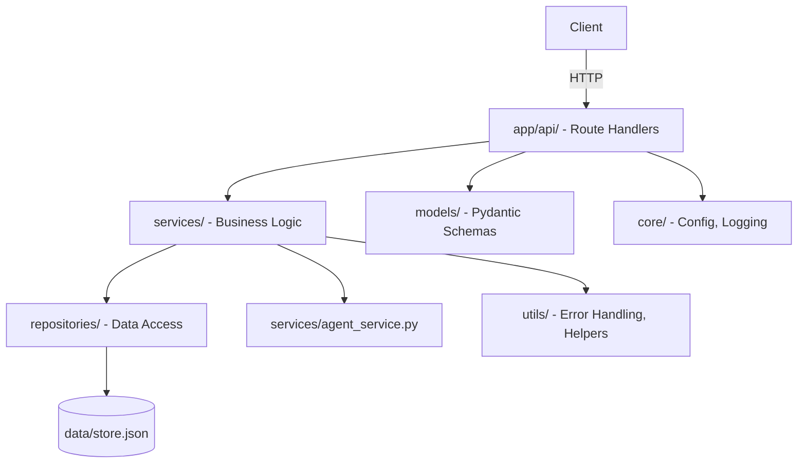
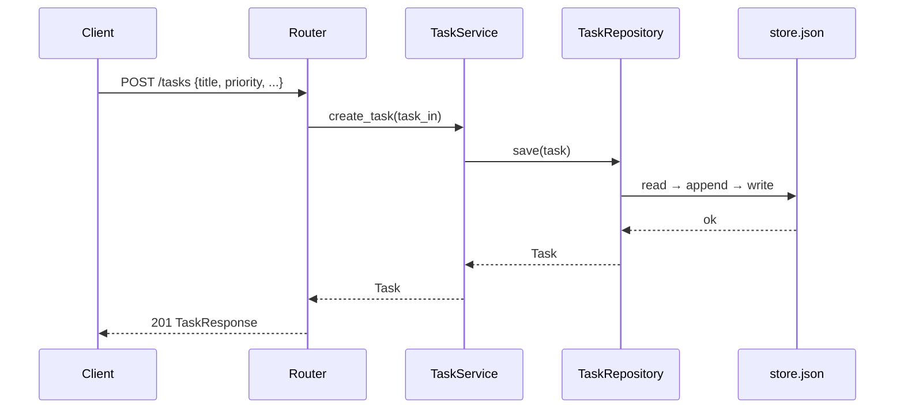
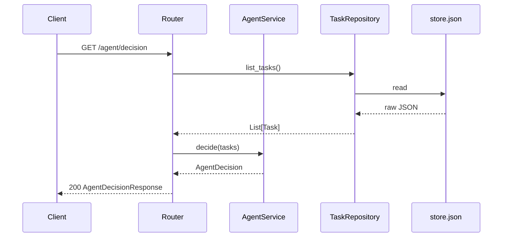

# Design Document: Productivity Agent API

## Overview

A minimal but production-grade agentic backend built with FastAPI and Python 3.11+. It accepts a list of tasks and a goal, runs a rule-based decision engine (agent), and returns the next best task to work on, a productivity score, and an actionable suggestion. The architecture is layered (Clean Architecture) so the agent logic and storage are fully decoupled and replaceable.

The system is stateless at the API level — all state lives in a file-based JSON store abstracted behind a repository layer. The agent itself is a set of pure functions with no side effects, making it trivially swappable with an LLM-backed agent later.

## Architecture



### Layer Responsibilities

- `app/api/` — HTTP route handlers only; no business logic; delegates to services
- `services/` — all business logic; agent decision engine lives here; no I/O
- `repositories/` — all file I/O; reads/writes `data/store.json`; returns domain models
- `models/` — Pydantic schemas for request/response validation and domain types
- `core/` — app settings (via pydantic-settings), structured logger factory
- `utils/` — custom exceptions, error response builder, shared helpers

## Sequence Diagrams

### POST /tasks — Create Task



### GET /agent/decision — Run Agent



## Components and Interfaces

### Router: TaskRouter (`app/api/tasks.py`)

**Purpose**: HTTP handlers for task CRUD operations.

```python
router = APIRouter(prefix="/tasks", tags=["tasks"])

@router.post("/", response_model=TaskResponse, status_code=201)
async def create_task(task_in: TaskCreate, service: TaskService = Depends()) -> TaskResponse

@router.post("/{task_id}/complete", response_model=TaskResponse)
async def complete_task(task_id: str, service: TaskService = Depends()) -> TaskResponse
```

### Router: AgentRouter (`app/api/agent.py`)

**Purpose**: HTTP handler for agent decision endpoint.

```python
router = APIRouter(prefix="/agent", tags=["agent"])

@router.get("/decision", response_model=AgentDecisionResponse)
async def get_decision(repo: TaskRepository = Depends()) -> AgentDecisionResponse
```

### Service: TaskService (`services/task_service.py`)

**Purpose**: Orchestrates task creation and completion; no I/O.

```python
class TaskService:
    def __init__(self, repo: TaskRepository) -> None

    def create_task(self, task_in: TaskCreate) -> Task
    def complete_task(self, task_id: str) -> Task
```

### Service: AgentService (`services/agent_service.py`)

**Purpose**: Pure, stateless decision engine. All functions are side-effect-free.

```python
def select_next_task(tasks: list[Task]) -> Task | None
def calculate_productivity_score(tasks: list[Task]) -> float  # 0.0 – 1.0
def generate_suggestion(next_task: Task | None, score: float) -> str
def decide(tasks: list[Task]) -> AgentDecision
```

**Preconditions for `decide`**:
- `tasks` is a list (may be empty)
- All items are valid `Task` instances

**Postconditions**:
- Returns `AgentDecision` with `next_task`, `productivity_score ∈ [0.0, 1.0]`, and non-empty `suggestion`
- If `tasks` is empty, `next_task` is `None` and `suggestion` is a motivational prompt

### Repository: TaskRepository (`repositories/task_repository.py`)

**Purpose**: Sole owner of file I/O. Reads/writes `data/store.json`.

```python
class TaskRepository:
    def __init__(self, store_path: Path) -> None

    def list_tasks(self) -> list[Task]
    def get_task(self, task_id: str) -> Task          # raises TaskNotFoundError
    def save_task(self, task: Task) -> Task
    def update_task(self, task: Task) -> Task          # raises TaskNotFoundError
```

## Data Models

### TaskCreate (`models/task.py`)

```python
class TaskCreate(BaseModel):
    title: str                          # non-empty, max 200 chars
    description: str = ""
    priority: int = Field(ge=1, le=5)   # 1 = lowest, 5 = highest
    tags: list[str] = []
```

### Task (`models/task.py`)

```python
class Task(BaseModel):
    id: str                             # UUID4
    title: str
    description: str
    priority: int
    tags: list[str]
    completed: bool = False
    created_at: datetime
    completed_at: datetime | None = None
```

### AgentDecision (`models/agent.py`)

```python
class AgentDecision(BaseModel):
    next_task: Task | None
    productivity_score: float           # 0.0 – 1.0
    suggestion: str
```

### ErrorResponse (`models/error.py`)

```python
class ErrorResponse(BaseModel):
    error_code: str
    message: str
    details: dict = {}
```

## Algorithmic Pseudocode

### Agent Decision Algorithm

```pascal
ALGORITHM decide(tasks)
INPUT: tasks — list of Task
OUTPUT: AgentDecision

BEGIN
  next_task ← select_next_task(tasks)
  score     ← calculate_productivity_score(tasks)
  suggestion ← generate_suggestion(next_task, score)

  ASSERT score >= 0.0 AND score <= 1.0
  ASSERT suggestion IS NOT EMPTY

  RETURN AgentDecision(next_task, score, suggestion)
END
```

### select_next_task

```pascal
ALGORITHM select_next_task(tasks)
INPUT: tasks — list of Task
OUTPUT: Task OR null

BEGIN
  pending ← FILTER tasks WHERE task.completed = false

  IF pending IS EMPTY THEN
    RETURN null
  END IF

  // Sort descending by priority, then ascending by created_at (FIFO tie-break)
  sorted ← SORT pending BY (priority DESC, created_at ASC)
  RETURN sorted[0]
END
```

**Preconditions**: `tasks` is a valid list (may be empty)
**Postconditions**: Returns the highest-priority pending task, or `None` if all tasks are done
**Loop Invariants**: N/A (sort-based, no explicit loop)

### calculate_productivity_score

```pascal
ALGORITHM calculate_productivity_score(tasks)
INPUT: tasks — list of Task
OUTPUT: score ∈ [0.0, 1.0]

BEGIN
  IF tasks IS EMPTY THEN
    RETURN 0.0
  END IF

  completed_count ← COUNT tasks WHERE task.completed = true
  total           ← LENGTH(tasks)

  // Weight by priority: completed high-priority tasks score more
  weighted_done  ← SUM(task.priority FOR task IN tasks WHERE task.completed = true)
  weighted_total ← SUM(task.priority FOR task IN tasks)

  IF weighted_total = 0 THEN
    RETURN 0.0
  END IF

  RETURN weighted_done / weighted_total
END
```

**Preconditions**: `tasks` is a list (may be empty)
**Postconditions**: `0.0 ≤ result ≤ 1.0`; returns `0.0` for empty list

### generate_suggestion

```pascal
ALGORITHM generate_suggestion(next_task, score)
INPUT: next_task — Task OR null, score ∈ [0.0, 1.0]
OUTPUT: suggestion — non-empty string

BEGIN
  IF next_task IS null THEN
    RETURN "All tasks complete. Add new tasks to keep momentum."
  END IF

  IF score >= 0.8 THEN
    RETURN "Great progress! Focus on: " + next_task.title
  ELSE IF score >= 0.5 THEN
    RETURN "Good pace. Next up: " + next_task.title
  ELSE
    RETURN "Low productivity score. Prioritize: " + next_task.title
  END IF
END
```

**Preconditions**: `score ∈ [0.0, 1.0]`
**Postconditions**: Returns a non-empty string in all branches

## Key Functions with Formal Specifications

### `create_task(task_in: TaskCreate) -> Task`

**Preconditions**:
- `task_in.title` is non-empty string, max 200 chars
- `task_in.priority ∈ [1, 5]`

**Postconditions**:
- Returned `Task` has a unique UUID `id`
- `task.completed = False`
- `task.created_at` is set to current UTC time
- Task is persisted in the repository

### `complete_task(task_id: str) -> Task`

**Preconditions**:
- `task_id` is a non-empty string
- A task with `task_id` exists in the repository

**Postconditions**:
- Returned `Task` has `completed = True`
- `task.completed_at` is set to current UTC time
- Updated task is persisted

**Raises**: `TaskNotFoundError` if `task_id` does not exist

## Example Usage

```python
# Create a task
POST /tasks
{
    "title": "Write unit tests for agent service",
    "priority": 5,
    "tags": ["testing", "agent"]
}
# → 201 { "id": "abc-123", "title": "...", "completed": false, ... }

# Run agent decision
GET /agent/decision
# → 200 {
#     "next_task": { "id": "abc-123", "title": "Write unit tests...", "priority": 5, ... },
#     "productivity_score": 0.0,
#     "suggestion": "Low productivity score. Prioritize: Write unit tests for agent service"
# }

# Complete a task
POST /tasks/abc-123/complete
# → 200 { "id": "abc-123", "completed": true, "completed_at": "2024-01-01T12:00:00Z", ... }
```

## Error Handling

### TaskNotFoundError

**Condition**: `task_id` passed to `complete_task` or `get_task` does not exist in the store
**HTTP Status**: 404
**Response**:
```json
{ "error_code": "TASK_NOT_FOUND", "message": "Task abc-123 not found", "details": {} }
```

### ValidationError (Pydantic)

**Condition**: Request body fails schema validation
**HTTP Status**: 422
**Response**: Standard FastAPI validation error, wrapped in `ErrorResponse` format via exception handler

### StoreCorruptedError

**Condition**: `store.json` exists but contains invalid JSON
**HTTP Status**: 500
**Response**:
```json
{ "error_code": "STORE_CORRUPTED", "message": "Data store is corrupted", "details": {} }
```

### Generic Unhandled Exception

**Condition**: Any unhandled exception
**HTTP Status**: 500
**Response**:
```json
{ "error_code": "INTERNAL_ERROR", "message": "An unexpected error occurred", "details": {} }
```

All errors are logged with `request_id`, `timestamp`, `log_level`, and exception traceback.

## Testing Strategy

### Unit Testing Approach

All business logic is tested in isolation. Services and agent functions are pure — no mocking needed for logic tests. Repository is mocked for service tests.

- `tests/test_agent_service.py` — pure function tests for `select_next_task`, `calculate_productivity_score`, `generate_suggestion`, `decide`
- `tests/test_task_service.py` — task creation and completion logic with mocked repository
- `tests/test_task_repository.py` — file I/O tests using `tmp_path` fixture (no real store)
- `tests/test_api_tasks.py` — FastAPI `TestClient` integration tests for task endpoints
- `tests/test_api_agent.py` — FastAPI `TestClient` integration tests for agent endpoint
- `tests/test_error_handling.py` — exception handler and error response format tests

**TDD order**: Write tests first, then implement. Each test file is created before its corresponding source module.

### Property-Based Testing Approach

**Library**: `hypothesis`

Key properties to verify:
- `calculate_productivity_score(tasks)` always returns a value in `[0.0, 1.0]` for any list of tasks
- `select_next_task(tasks)` always returns a task from the input list (or `None` if all completed)
- `decide(tasks)` always returns a non-empty `suggestion` string

### Integration Testing Approach

FastAPI `TestClient` with an in-memory or `tmp_path`-backed repository injected via dependency override. No real `store.json` touched during tests.

## Performance Considerations

File-based JSON storage is synchronous and suitable for the toy scope (< 1000 tasks). The repository layer is the natural swap point for async DB access (e.g., SQLAlchemy async, Motor). Agent decision runs in O(n log n) due to sorting — acceptable for the target scale.

## Security Considerations

No authentication in scope. Input validation via Pydantic prevents injection via request bodies. File path for the store is configured via settings (not user-supplied), preventing path traversal. Error responses never leak internal stack traces to the client.

## Dependencies

```
fastapi>=0.111
uvicorn[standard]>=0.29
pydantic>=2.7
pydantic-settings>=2.2
pytest>=8.2
pytest-asyncio>=0.23
httpx>=0.27          # for TestClient
hypothesis>=6.100    # property-based tests
```
